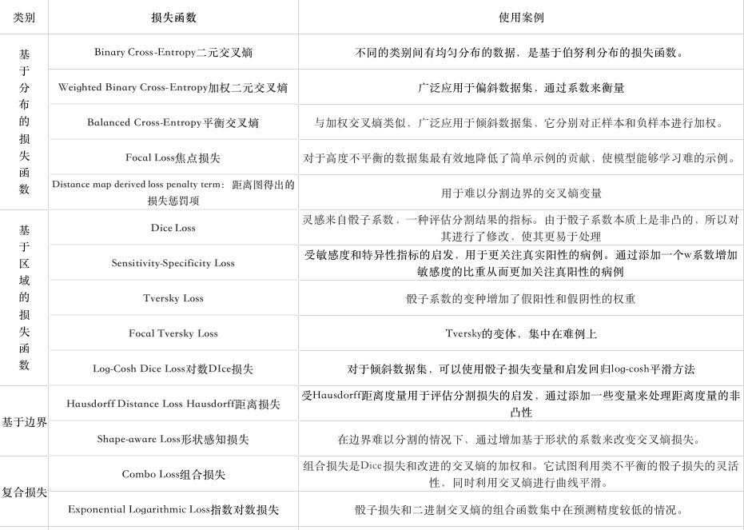

# 损失函数

- [A survey of loss functions for semantic segmentation](https://paperswithcode.com/paper/a-survey-of-loss-functions-for-semantic) | [译文1](https://freewechat.com/a/MzI5MDUyMDIxNA==/2247500026/3), [译文2](https://zhuanlan.zhihu.com/p/267128903)

