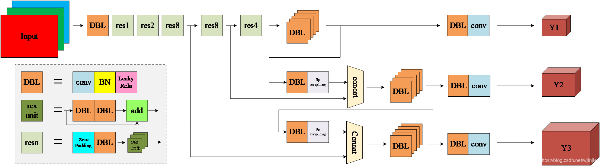

# 目标检测综述

- 综述0：[目标检测二十年（2001-2021）](https://www.cvmart.net/community/detail/4992)

- 综述1：[Object Detection in 20 Years: A Survey](https://paperswithcode.com/paper/object-detection-in-20-years-a-survey) | [译文](https://blog.csdn.net/sll_0909/article/details/97035524)
- 综述2：[A Survey of Deep Learning-based Object Detection](https://paperswithcode.com/paper/a-survey-of-deep-learning-based-object) | [译文](https://blog.51cto.com/u_13977270/3398862#%E6%91%98%E8%A6%81)
- 综述3：[Recent Advances in Deep Learning for Object Detection](https://paperswithcode.com/paper/recent-advances-in-deep-learning-for-object)|[译文](https://blog.csdn.net/jiaoyangwm/article/details/105171376)
- 综述4:  [Imbalance Problems in Object Detection: A Review](https://paperswithcode.com/paper/imbalance-problems-in-object-detection-a)|[译文1](https://blog.csdn.net/qq_24548569/article/details/105164046),[译文2](https://blog.csdn.net/qq_41498261/article/details/120613629)
- 综述5：[Deep Domain Adaptive Object Detection: a Survey](https://paperswithcode.com/paper/deep-domain-adaptive-object-detection-a)|[译文](https://blog.csdn.net/weixin_36670529/article/details/106305638)
- 综述6：[Foreground-Background Imbalance Problem in Deep Object Detectors: A Review](https://paperswithcode.com/paper/foreground-background-imbalance-problem-in)|[译文](https://zhuanlan.zhihu.com/p/436480299)

## Yolo系列

- YoloV1:[You Only Look Once: Unified, Real-Time Object Detection](https://paperswithcode.com/paper/you-only-look-once-unified-real-time-object)|[博客](https://blog.csdn.net/wjinjie/article/details/107509243)
- YoloV2:[YOLO9000: Better, Faster, Stronger](https://paperswithcode.com/paper/yolo9000-better-faster-stronger)|[博客](https://blog.csdn.net/wjinjie/article/details/107509243)
- YoloV3：[YOLOv3: An Incremental Improvement](https://paperswithcode.com/paper/yolov3-an-incremental-improvement)|[博客](https://blog.csdn.net/wjinjie/article/details/107509243)
- YoloV4:[YOLOv4: Optimal Speed and Accuracy of Object Detection](https://paperswithcode.com/paper/yolov4-optimal-speed-and-accuracy-of-object)|[博客](https://blog.csdn.net/wjinjie/article/details/107509243)
- YoloV5:[Path Aggregation Network for Instance Segmentation](https://paperswithcode.com/paper/path-aggregation-network-for-instance)|[博客](https://blog.csdn.net/wjinjie/article/details/107509243)
- YoloX:[YOLOX: Exceeding YOLO Series in 2021](https://paperswithcode.com/paper/yolox-exceeding-yolo-series-in-2021)|[博客](https://zhuanlan.zhihu.com/p/397993315) ,[YOLOX课程]( https://edu.51cto.com/center/course/lesson/index?id=774242),[YOLOX结构图](https://blog.csdn.net/nan355655600/article/details/119329727)

## 网络组件

- FPN: https://cloud.tencent.com/developer/article/1546594
- PAFPN: https://zhuanlan.zhihu.com/p/397020975

## 网络结构

##### YoloV3

# 🍭项目篇

## ️ 目标检测/Detection

- 🐾   [Yolo v1](https://github.com/TD-4/yolov1) | [notes](train/detection/yolov1.md)
- 🐾   [Yolo v2](https://github.com/TD-4/yolov2) | [notes](train/detection/yolov2.md)
- 🐾   [Yolo v3](https://github.com/TD-4/yolov3) | [notes](train/detection/yolov3.md)
- 🐾   [Yolo v4](https://github.com/TD-4/yolov4) | [Yolov4](https://github.com/TD-4/yolov4_) | [notes](train/detection/yolov4.md)
- 🐾   [YoloX](https://github.com/FelixFu520/YOLOX) |  [notes](train/detection/yolov4.md)

## ️ 小样本/Few Shot Learning

- 🐾 PANet- [📒](train/fsl/panet.md)

## ️ 图像质量评价/Image Quality Assessment

- 🐾 hyperIQA-| [-v2回归](https://github.com/TD-4/ScreenCheck) [V2-分类](https://github.com/TD-4/ScreenCheck_cls)|[📒](train/iqa/hypernet.md)

